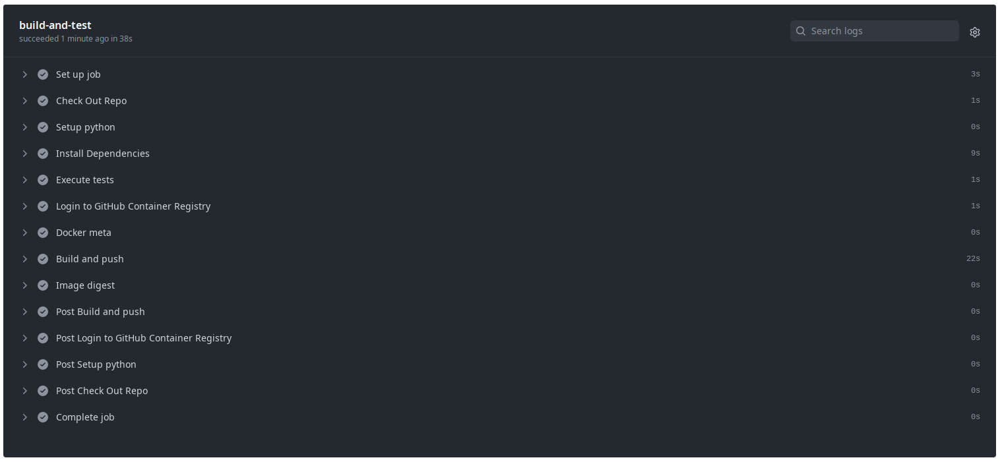
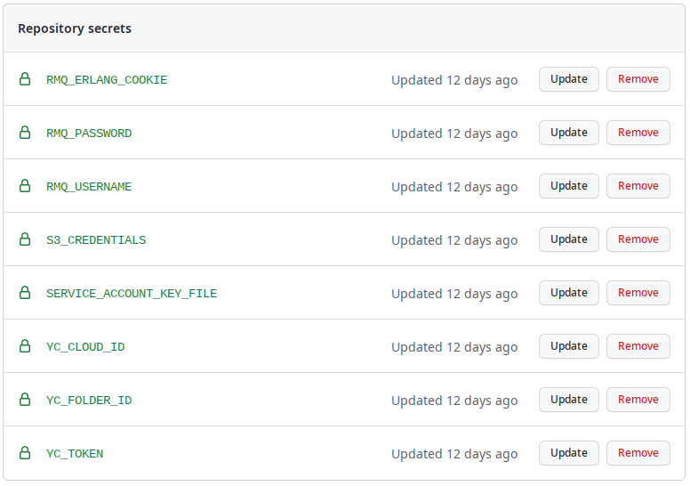
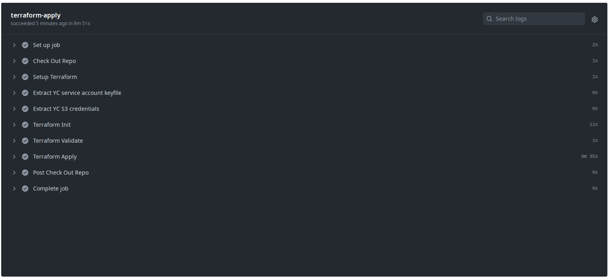
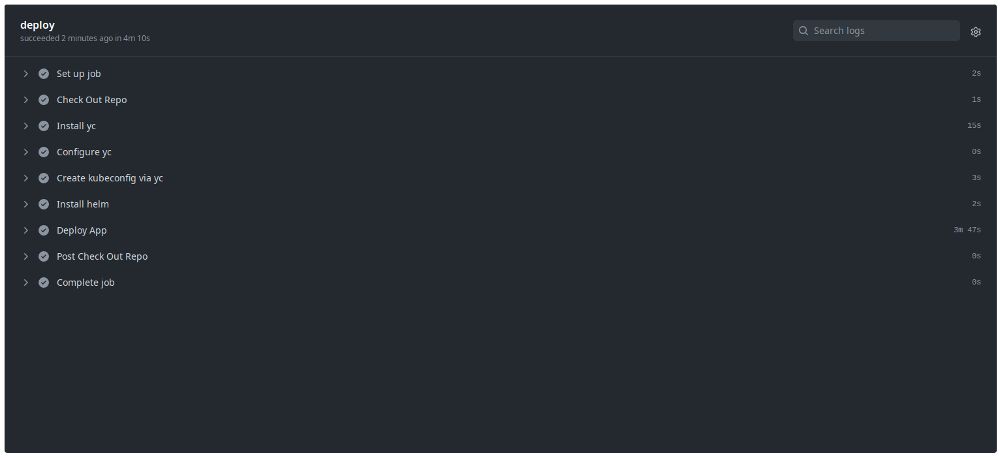
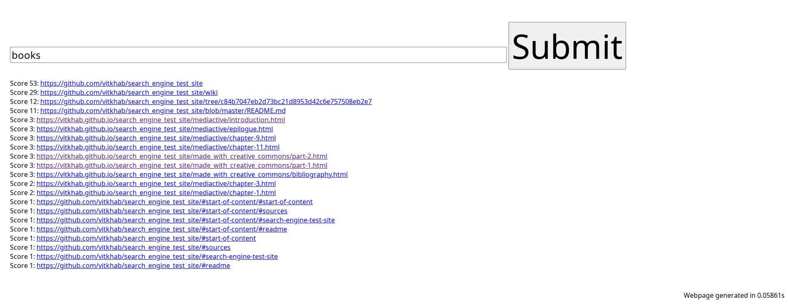
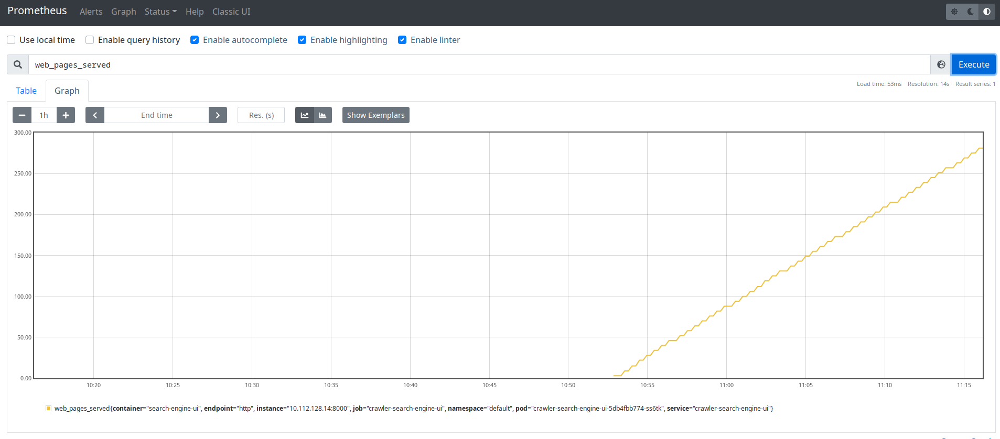
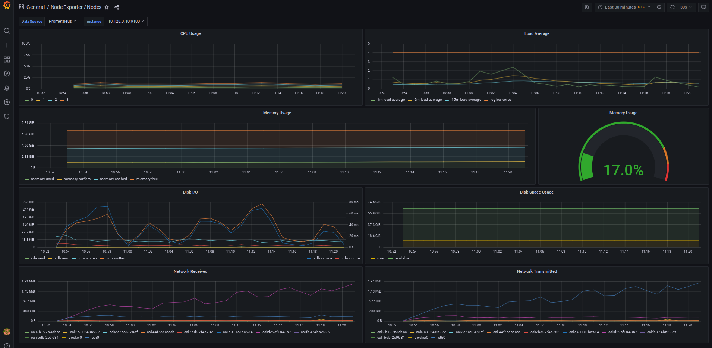

# Проектная работа по курсу "DevOps практики и инструменты"

[Демо приложение](http://84.201.130.75/)

[Prometheus](http://84.201.130.75/prometheus/)

[Grafana](http://84.201.130.75/grafana/)

[Crawler microservice repo](https://github.com/lburinov73/search_engine_crawler/)
[UI microservice repo](https://github.com/lburinov73/search_engine_ui/)


## Как запустить / как работает

 - В репозиториях с кодом приложения использовать workflow build-and-test.yml<br/>
   (см. файл ```.github/workflows/build-and-test.yml```)<br/>
   В рамках этого workflow происходит checkout кода, запуск тестов, сборка образа и публикация его в GitHub Registry
 - В infra-репозитории использовать workflow terraform-apply.yml<br/>
   (см. файл ```.github/workflows/terraform-apply.yml```)<br/>
   В рамках этого workflow будет развернут Managed Kubernetes кластер в YandexCloud
 - В infra-репозитории использовать workflow deploy.yml<br/>
   (см. файл ```.github/workflows/deploy.yml```)<br/>
   В рамках этого workflow будет установлено приложение с зависимостями, а так же kube-prometheus-stack
 - Зависимости приложения: mongodb - используется helm chart bitnami/mongodb и rabbitmq - используется bitnami/rabbitmq
 - Prometheus Operator - используется chart [kube-prometheus-stack](https://prometheus-community.github.io/helm-charts)
 - Ingress - используется chart bitnami/nginx-ingress-controller

## Конфигурация terraform для Kubernetes кластера в Yandex Cloud

 - Требуется S3 хранилище для хранения tfstate файлов<br/>
   (см. ```backend.tf```)
 - В секрет ```S3_CREDENTIALS``` нужно сохранить в формате base64 креденшелы IAM пользователя с доступом к созданному S3 бакету<br/>
   ```cat credentials | base64 -i```<br/>
   (формат файла с креденшелами можно посмотреть в файле ```credentials.example```)
 - Параметры Яндекс облака и kubernetes кластера задаются в файле ```terraform.tfvars```
 - В секрет ```SERVICE_ACCOUNT_KEY_FILE``` нужно сохранить ключ сервисного аккаунта YC в формате base64<br/>
   ```cat key.json | base64 -i```

Для создания кластера (или изменения его параметров) можно использовать Action *Terraform Apply*<br/>
(см. файл ```.github/workflows/terraform-apply.yml```)

Для удаления кластера можно использовать Action *Terraform Destroy*<br/>
(см. файл ```.github/workflows/terraform-destroy.yml```)

## Helm chart-ы проекта

 - В секреты YC_TOKEN, YC_CLOUD_ID и YC_FOLDER_ID нужно сохранить параметры для подключения к Yandex облаку (API Token и IDшники облака и каталога)
 - В секреты RMQ_USERNAME, RMQ_PASSWORD, RMQ_ERLANG_COOKIE нужно сохранить креденшелы для подключения к RabbitMQ, иначе будут взяты значения по умолчанию из ```values.yaml```
Для деплоя приложения в кластер можно использовать Action *Deploy Project*<br/>
(см. файл ```.github/workflows/deploy.yml```)


## Скриншоты

Сборка образа:


Секреты репозитория infra:


Развертывание кластера с помощью Terraform:


Деплой приложения:


Демо приложения:


Prometheus:


Grafana:


